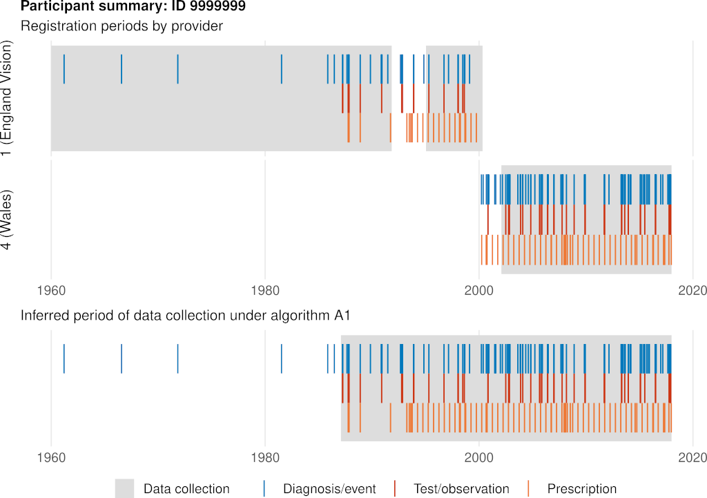
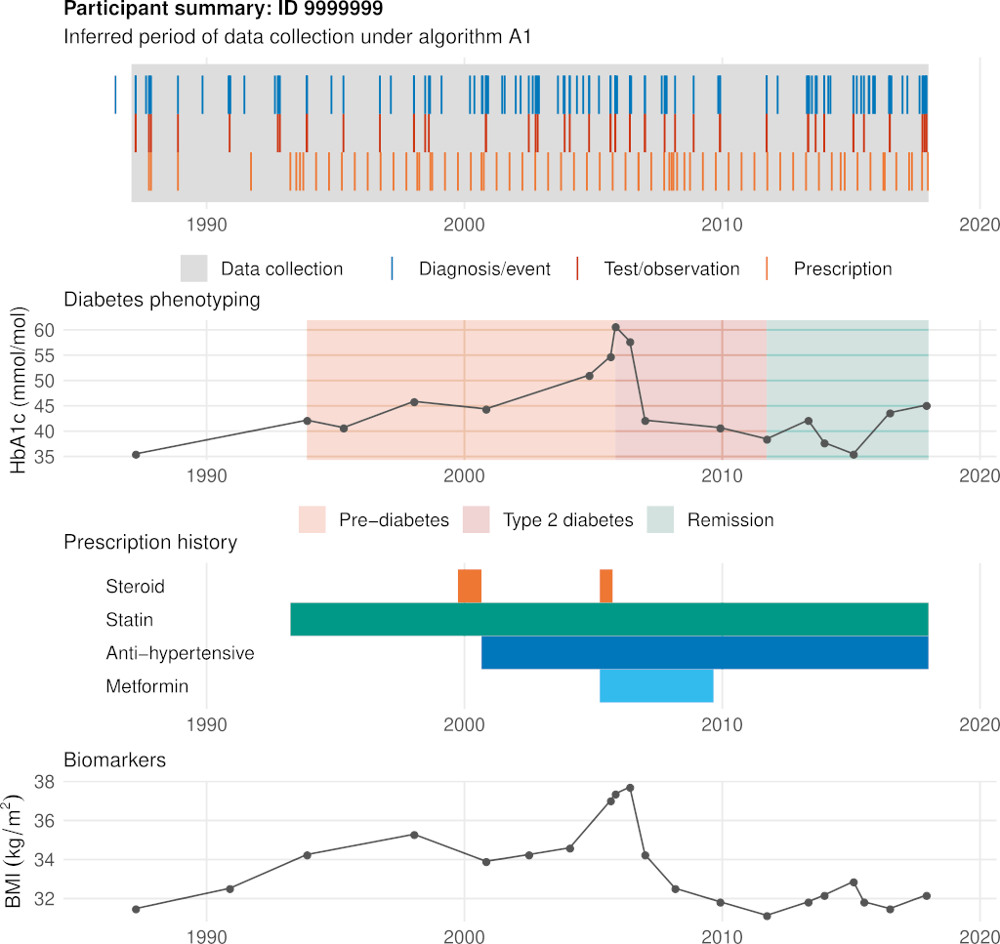

# Prepare UK Biobank EHR data for research

Clean and prepare UK Biobank primary care EHR for research. Tested with the [interim EHR data release](https://biobank.ndph.ox.ac.uk/showcase/ukb/docs/primary_care_data.pdf).

## Installation

1. Install the `ukbbhelpr` R package from [here](https://github.com/philipdarke/ukbbhelpr).
2. Clone the EHR code set repository [here](https://github.com/philipdarke/ehr-codesets).
3. Clone this repository and follow the instructions below.

The following R packages are required. Install them using:

```R
required <- c("zoo", "dplyr", "plyr", "ggplot2", "cowplot")
optional <- c("caret", "QDiabetes", "survival")
install.packages(required)
install.packages(optional)  # needed to run code in the paper directory
```

## UK Biobank data

Download the data for your UK Biobank application from the [data showcase](https://biobank.ndph.ox.ac.uk/showcase/). The following fields are required to process the primary care EHR data:

Description | Field
----------- | -----
Year and month of birth | `34`, `52`
Date of assessment centre visit | `53`
Linked date of death | `40000`

The fields below are required to run the code in the `02_extract_records` and `paper` directories:

Description | Field
----------- | -----
Demographic data | `31`, `189`, `21000`
| Anthropomorphic measurements | `48`, `50`, `21002`
HbA1c blood glucose  | `30750`
Self-reported non-cancer medical history | `2986`, `20002`, `20003`, `20008`
Smoking history | `1249`, `2887`, `3456`, `20116`
Summary secondary care data | `41270`, `41271`, `41272`, `41273`, `41280`, `41281`, `41282`, `41283`

:warning: Edit `01_prepare_data/01_subset_visit_data.R` if any of the optional fields above are unavailable.

In addition, the primary care data is required:

Description | File
----------- | ----
Participant registration records | `gp_registrations.txt`
Clinical event records | `gp_clinical.txt`
Prescription records | `gp_scripts.txt`

## Prepare the data for research

1. Update `file_paths.R` with the paths to your downloaded data.
2. Run the scripts in the `01_prepare_data` directory sequentially to infer periods of data collection for each participant. The results are saved in `data/data_period.rds` by default.
3. Run the scripts in the `02_extract_records` directory sequentially to extract the files marked * in the table below.

Alternatively, `run_all.R` can be run instead of steps 3 and 4.

:warning: The EHR data are large files and `run_all.R` in particular is very memory intensive. Use of a high performance computing service is recommended. UK Biobank data must be stored and processed as required under the Material Transfer Agreement.

Tested with the September 2019 interim EHR release on an Intel Xeon E5-2699 v4 processor (2.2 GHz, 22 cores, 55 MB cache) with 256Gb RAM running R 3.6 on CentOS Linux 7. The code has not been tested on R 4.0+.

## Output summary

The following files are saved in the `data` directory by default:

File | Description
---- | -----------
`data_period.rds` | Period(s) of EHR data collection for each participant
`gp_event.rds` | Clean event/diagnosis data
`gp_presc.rds` | Clean prescription data
`biomarkers.rds`* | Extracted biomarkers
`demographic.rds`* | Ethnicity, smoking history and Townsend deprivation
`family_history.rds`* | Family history data
`diagnoses.rds`* | Extracted diagnosis codes for a range of common conditions
`prescriptions.rds`* | Estimated periods during which selected drugs were prescribed

Files marked * are generated by the scripts in the `02_extract_records` directory.

## Visualising the results

### Estimating periods of EHR data collection

`visualisation/01_algorithm.R` can be used to plot the results of the algorithm used to infer periods of EHR data collection for a participant.



### Diabetes phenotyping case study

`visualisation/02_phenotyping.R` can be used to plot the results of the diabetes phenotyping algorithm. `paper/02_diabetes_phenotyping.R` must be run first.



## Licence

Made available under the [MIT Licence](LICENCE).